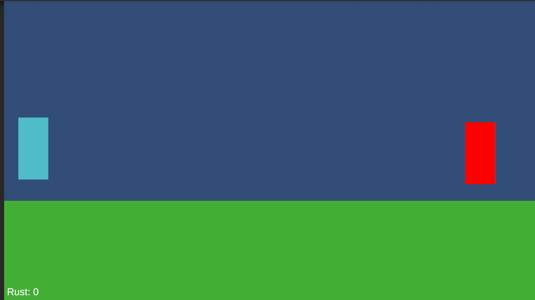
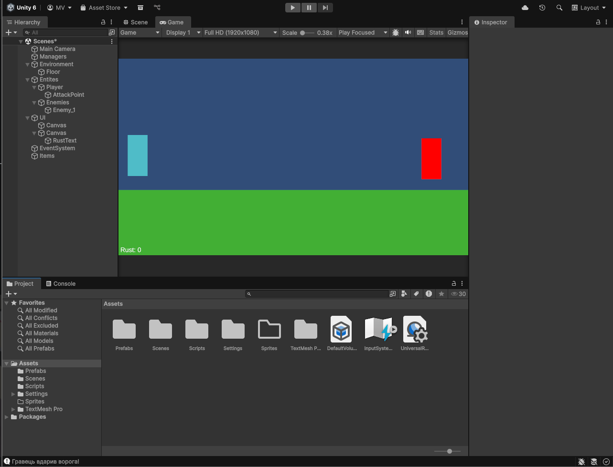
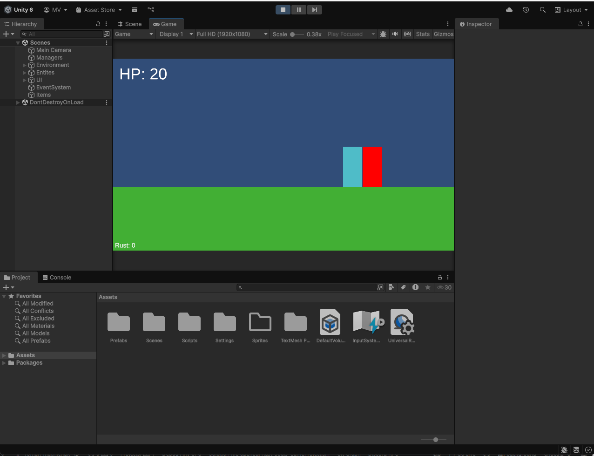

# Лабораторна робота №3
### Дисципліна: Геймдизайн та програмування ігрових застосунків
### Тема: Створення базового ігрового прототипу та реалізація основних ігрових механік
### Студент: Матвійчук Роман
### Група: ІПЗ-3/2
### Дата: 03.05.2026
## 1. Короткий опис виконанної роботи
У межах лабораторної роботи було реалізовано прототип гри Rust & Souls - 2D Roguelike-екшену в індустріальному сетингу. 

Основна ідея MVP полягає у відпрацюванні базового бойового циклу: переміщення героя, бойова взаємодія з ворогами та збір ресурсів.
### Елементи MVP:
- керування персонажем (рух та ривок).
- базова бойова механіка (атака ближнього бою).
- система випадання та збору лутів (Rust та Souls).
- прототип процедурної кімнати.
- простий інтерфейс дляя відстеження стану гравця.
## 2. Перелік реалізованих механік
Character Controller - Забезпечує рух гравця (WASD або стрілками) та маневри ухилення (Dash)

Real-time Combat - дозволяє наносити шкоду ворогам за допомогою базової атаки.

Resource Drop System - випадання ресурсів Rust та Souls після перемоги над ворогом.

Простий HUD - візуалізація здоров'я та лічильників зібраних ресурсів.
## 3. Change log
- Створено базову сцену: Налаштовано 2D оточення.
- Реалізовано переміщення персонажа: Налаштовано керування через WASD та механіку Dash для динаміки.
- Додано бойову систему: Створено скрипт атаки гравця та систему отримання шкоди для ворогів (метал і тіні).
- Реалізовано збір ресурсів: Додано логіку накопичення Rust (для апгрейдів) та Souls (для перків). 
- Налаштовано UI: Додано простий HUD, що не перекриває огляд.
## 4. Скріншоти

## 5. Посилання на репозиторію
https://github.com/romansxxq/Rust-Souls_GameProject/tree/roman-matviichuk
## 6. Висновок
Під час виконання роботи було успішно реалізовано кістяк гри Rust & Souls.  
Виконані завдання: 
- Створено прототип, що демонструє основний ігровий цикл "Дослідження — Бій — Збір ресурсів".  
- Коректна робота: Механіки руху, атаки та збору ресурсів працюють стабільно, відповідаючи вимогам GDD щодо чутливості керування.  
- Потребує доопрацювання: Система процедурної генерації наразі обмежена однією кімнатою; у майбутньому необхідно реалізувати повноцінний лабіринт руїн та систему міжзабігової прогресії (Meta-progression) у хабі.
Технічна реалізація виконана. 

Дизайн та менеджмент проєкту на етапі прототипування були відсутні.