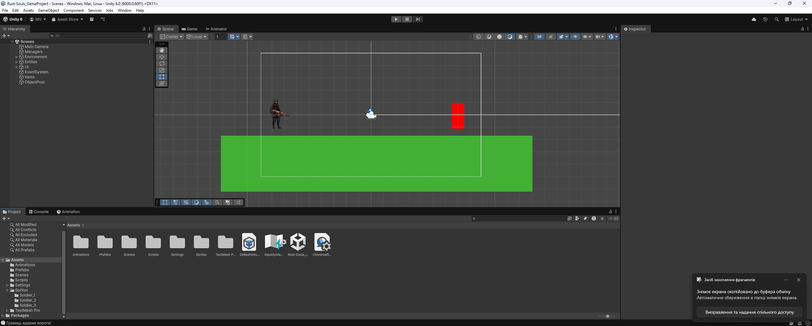
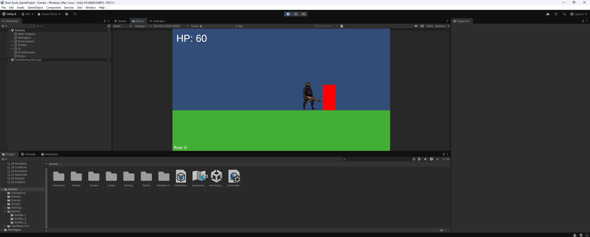
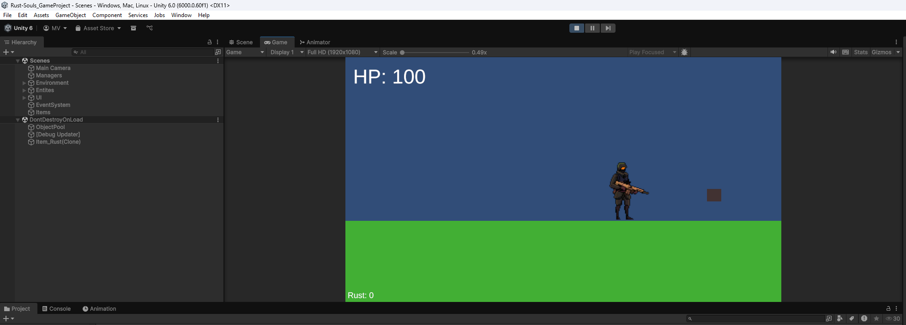

# Лабораторна робота №4
### Дисципліна: Геймдизайн та програмування ігрових застосунків
### Тема: Удосконалення ігрового прототипу: базові асети, UI та Object Pool
### Мета роботи: Оптимізувати прототип за рахунок повторного використання об'єктів (Object Pool), покращити взаємодію гравця та відображення станів персонажа.
### Студент: Матвійчук Роман
### Група: ІПЗ-3/2
### Дата: 10.05.2026

## 1. Опис доопрацьованого прототипу

У межах лабораторної роботи було доопрацьовано базовий ігровий прототип, з фокусом на розширення технічного функціоналу та оптимізацію. Зокрема, вдосконалено контролер гравця: реалізовано систему керування анімаціями (ходьба, атака, отримання шкоди, смерть), налаштовано безпечний доступ до показників здоров'я та оновлено логіку смерті (персонаж більше не зникає миттєво). Крім того, для уникнення падіння продуктивності через постійне створення та знищення об'єктів, було впроваджено патерн Object Pool, який тепер відповідає за генерацію луту з ворогів та предметів збору. Оскільки фінальні графічні асети ще перебувають у стадії розробки, для демонстрації працездатності прототипу (UI, Object Pool, префабів) було використано базові тимчасові асети (плейсхолдери) та наявний спрайт персонажа.

## 2. Перелік реалізованих елементів

- Оновлені ігрові об'єкти: логіка гравця (анімації Walk/Attack/Hurt/Death), логіка здоров'я, логіка підбору предметів.
- Використані базові асети: наявні анімаційні кліпи персонажа (Idle/Walk/Attack/Hurt/Death).
- Створені prefab-об'єкти: лут ворогів (dropPrefab), предмети збору (CollectibleItem).
- Реалізовані UI-елементи: індикатор HP (TextMeshPro).
- Object Pool: лут ворогів і предмети збору.

## 3. Опис роботи Object Pool

У проєкті реалізовано Object Pool для луту, який з'являється після смерті ворога, та предметів збору. Кількість об'єктів для пулу задається у компоненті `SimpleObjectPool` (prewarm). Якщо prewarm не задано, об'єкт створюється при першому запиті. При смерті ворога лут береться з пулу, активується і розміщується у сцені. Після підбору предмет деактивується і повертається в пул для повторного використання. Це зменшує кількість операцій `Instantiate/Destroy` і знижує лаги під час гри.

## 4. Change log

- Додано систему Object Pool (`SimpleObjectPool`, `PooledInstance`).
- Змінено створення луту ворогів на повторне використання об'єктів.
- Змінено підбір предметів: об'єкти повертаються в пул.
- Додано керування анімаціями Walk/Attack/Hurt/Death у гравця.
- Додано читання поточного/максимального HP через властивості.
- Змінено поведінку при смерті гравця (не зникає одразу).

## 5. Скріншоти

Рисунок 5.1 - Сцена Unity з асетами.

Рисунок 5.2 - Скріншот гри в режимі Play з активним UI

Рисунок 5.3 - Скріншот роботи Object Pool
## 6. Посилання на репозиторій

- Репозиторій: https://github.com/romansxxq/Rust-Souls_GameProject.git

## 7. Висновок

У ході роботи успішно доопрацьовано технічну базу прототипу: реалізовано керування базовими анімаціями персонажа, оновлено логіку обробки здоров'я та UI-відображення HP. Зарефакторив деякі коди з використанням [SerializeField]. Крім того, впроваджено Object Pool для луту з ворогів і предметів збору, що суттєво зменшило кількість операцій створення/видалення об'єктів і покращило стабільність гри. Програмна частина готова до масштабування. Що потребує подальшого вдосконалення: розширення пулу на інші візуальні ефекти, інтеграція повноцінного графічного пакету (фінальних анімацій, фонів, унікальних спрайтів ворогів), а також налаштування геймдизайнерських балансів одразу після отримання відповідних даних від команди розробки.
