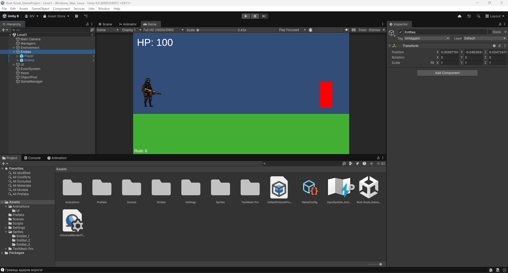
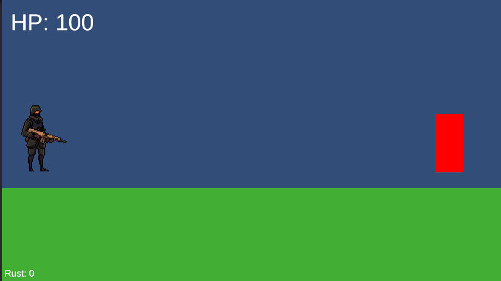
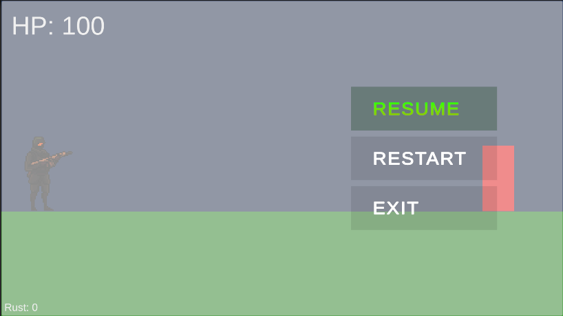
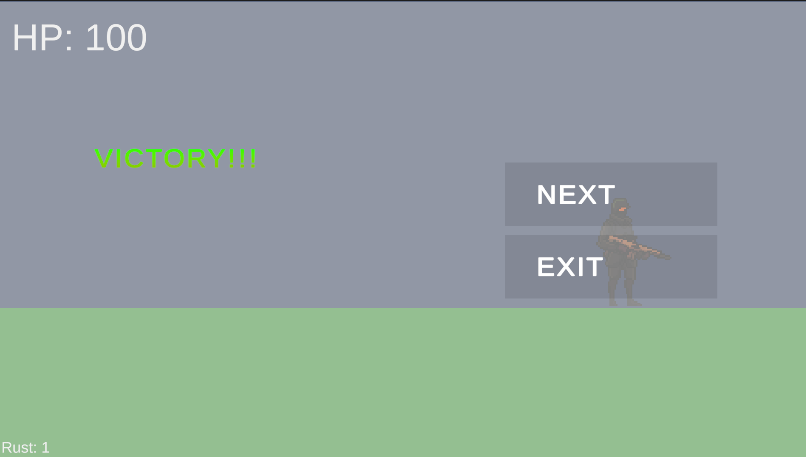
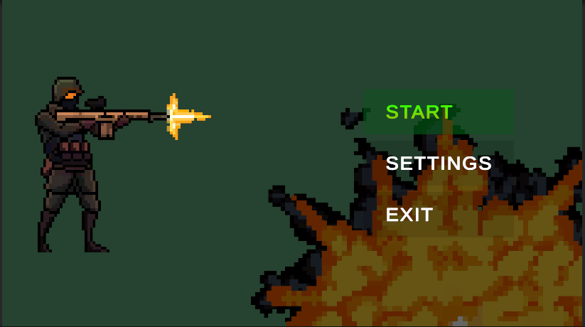

# Лабораторна робота №5
### Дисципліна: Геймдизайн та програмування ігрових застосунків
### Тема: Створення HUD, головного меню, конфігурацій, вікон станів гри та системи рівнів
### Мета роботи: Розширити прототип Rust & Souls до демонстраційної версії з повноцінним HUD, головним меню, вікнами станів гри, конфігурацією параметрів через ScriptableObject та системою двох ігрових рівнів.
### Студент: Матвійчук Роман
### Група: ІПЗ-3/2
### Дата: 30.06.2026

## 1. Опис доопрацьованого прототипу

У межах лабораторної роботи прототип Rust & Souls розширено до демонстраційної версії гри. Основний фокус — побудова повноцінного ігрового циклу: від головного меню до завершення рівня з відповідним вікном стану.

Реалізовано два ігрових рівні (Level1, Level2) з умовою перемоги «знищити всіх ворогів» (`KillAllEnemies`). Параметри кожного рівня (швидкість гравця, кількість життів, складність ворогів, номер рівня, перехід до наступної сцени) винесено в окремий `ScriptableObject` — `GameConfig`. Центральний `GameManager` керує паузою, перемогою, поразкою та навігацією між сценами. HUD оновлено: додано Slider здоров'я, лічильники Rust і Souls, кількість життів та номер рівня.

На момент виконання роботи геймдизайнер команди не надав фінальні спрайти ворогів, оточення та UI-елементів. У зв'язку з цим демонстраційна версія використовує тимчасові плейсхолдери та наявні асети з попередніх лабораторних робіт. Вся програмна логіка реалізована в повному обсязі й готова до підключення фінального арту.

## 2. Опис системи рівнів

Гра містить дві ігрові сцени:

- **Level1** — початковий рівень з базовими ворогами. Після знищення всіх ворогів відбувається перехід до Level2.
- **Level2** — рівень з підвищеною складністю (більша швидкість ворогів, вищий damage). Після перемоги гравець повертається до головного меню.

Навігація між сценами реалізована через `GameManager.NextLevel()`, який зчитує назву наступної сцени з `GameConfig.nextSceneName`. Умова перемоги відстежується компонентом `LevelGoal` через пошук об'єктів з тегом `Enemy` у кожному кадрі.

## 3. Перелік реалізованих елементів

### Конфігурація (`GameConfig.cs`)
- Швидкість гравця, сила стрибка, швидкість Dash
- Максимальне здоров'я гравця
- Кількість початкових життів
- Номер рівня
- Назва наступної сцени та сцени головного меню
- Швидкість і damage ворогів
- Параметри умови перемоги (кількість Rust/Souls для збору)

### HUD (`HUDController.cs`)
- Slider + текст поточного/максимального HP
- Лічильник Rust
- Лічильник Souls
- Кількість залишених життів
- Номер поточного рівня

### Головне меню (`MenuContoller.cs`)
- Кнопка «Почати гру» → завантажує Level1
- Кнопка «Продовжити» → завантажує останню збережену сцену
- Кнопка «Вихід» → закриває гру

### Вікна станів гри (`GameManager.cs`)
- **PausePanel** — викликається клавішею Escape; кнопки: Продовжити, Рестарт, Меню
- **VictoryPanel** — з'являється після виконання умови перемоги; кнопки: Наступний рівень, Меню
- **DefeatPanel** — з'являється після смерті гравця; кнопки: Рестарт, Меню

### Умова перемоги (`LevelGoal.cs`)
- Режим `KillAllEnemies` — перемога після знищення всіх ворогів з тегом `Enemy`
- Режим `ReachZone` — гравець досягає тригерної зони
- Режим `CollectResources` — гравець збирає задану кількість Rust/Souls

### Система рівнів
- Дві сцени: Level1, Level2
- Окремий `GameConfig` для кожного рівня
- Перехід між рівнями через `GameManager.NextLevel()`

## 4. Change log

- Створено ScriptableObject `GameConfig` з параметрами гравця, ворогів та рівня.
- Створено `GameManager` — центральний менеджер стану гри (пауза, перемога, поразка, навігація).
- Реалізовано `HUDController` з підтримкою Slider HP, ресурсів, життів та номера рівня.
- Оновлено `PlayerInventory`: додано публічні властивості `RustCount` та `SoulsCount`.
- Створено `LevelGoal` з трьома режимами умови перемоги.
- Оновлено `MenuContoller`: додано `ContinueButton()`, `LoadLevelButton()`, виправлено `ExitButton()` для Editor.
- Створено сцену Level2 на основі Level1 з підвищеною складністю.
- Налаштовано `GameConfig_Level1` (nextSceneName = "Level2") та `GameConfig_Level2` (nextSceneName = "").
- Додано всі сцени до Build Settings у правильному порядку (MainMenu → Level1 → Level2).
- Створено та налаштовано PausePanel, VictoryPanel, DefeatPanel на Canvas кожного рівня.
- Зафіксовано зміни в Git-репозиторії.

## 5. Скріншоти

Рисунок 5.1 — Сцена Level1 в Unity Editor з розміщеними ігровими об'єктами.

Рисунок 5.2 — Гра в режимі Play з активним HUD (HP, Rust, Souls, Життя, Рівень).

Рисунок 5.3 — Вікно паузи (PausePanel) з кнопками навігації.

Рисунок 5.4 — Вікно перемоги (VictoryPanel) після знищення всіх ворогів.

Рисунок 5.5 — Головне меню гри (MainMenu).

## 6. Посилання на репозиторій

- Репозиторій: https://github.com/romansxxq/Rust-Souls_GameProject/tree/roman-matviichuk

## 7. Висновок

У ході виконання лабораторної роботи програмна частина прототипу Rust & Souls повністю розширена до рівня демонстраційної версії. Реалізовано два ігрових рівні з різною складністю та автоматичним переходом між ними. Параметри гри централізовані у `GameConfig` (ScriptableObject), що дозволяє змінювати баланс без правки коду. HUD відображає всі ключові показники гравця в реальному часі. Вікна станів (пауза, перемога, поразка) коректно зупиняють гру та надають гравцю відповідні варіанти дій. Головне меню забезпечує базову навігацію.

Візуальна частина демонстраційної версії залишається на рівні плейсхолдерів через відсутність фінальних графічних асетів від геймдизайнера: спрайти ворогів, оточення та тематичні UI-елементи не були надані в рамках даного етапу розробки. Це не є технічним обмеженням — код архітектурно готовий до підключення будь-яких спрайтів і анімацій.

Що потребує подальшого вдосконалення: інтеграція фінального арту після отримання від геймдизайнера, реалізація Meta-progression між забігами, процедурна генерація рівнів, збереження прогресу між сесіями.

Чому вони не виконали - не розумію...